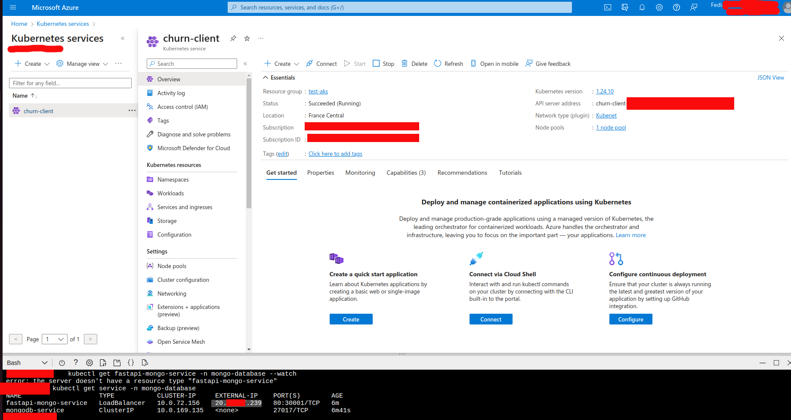
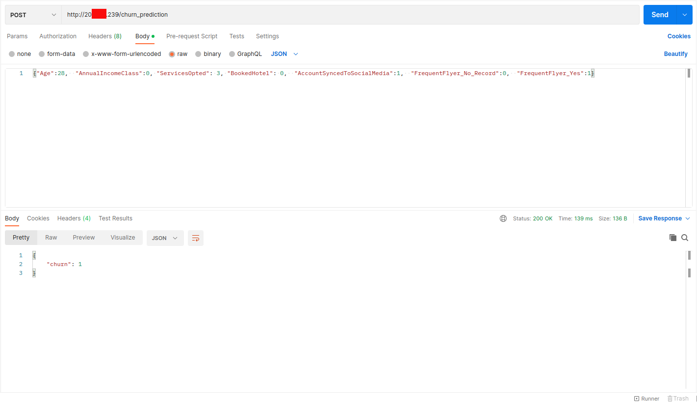
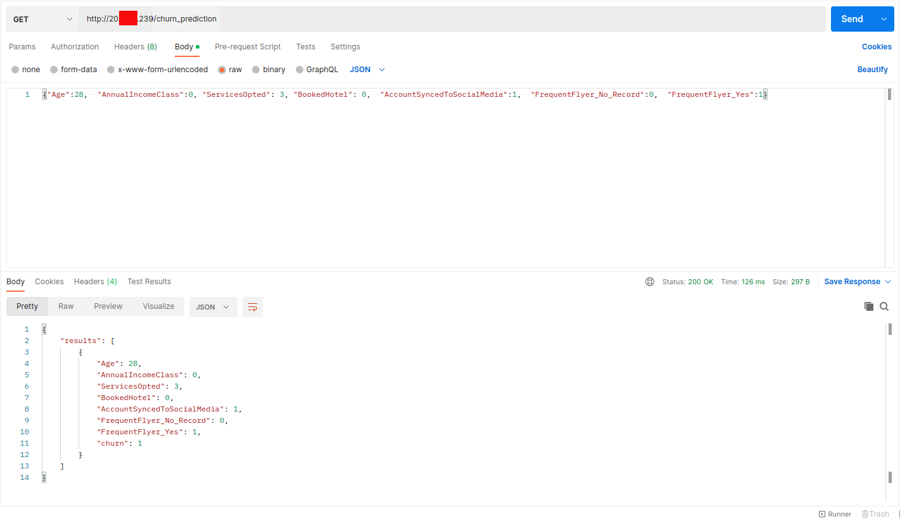

# Deploying Travel Customer Churn Prediction app on Azure Kubernetes Service

## Prerequisites

Before you start, you will need the following:
* An Azure subscription
* Azure CLI installed on your machine
* Kubernetes CLI (kubectl) installed on your machine
* Docker installed on your machine
### Step 1: Create an Azure Kubernetes Service Cluster
1. Open your terminal and sign in to your Azure account using the az login command.

2. Create a resource group for your cluster using the **az group create** command. For example:
```
az group create --name myResourceGroup --location eastus
```
3. Create a Kubernetes cluster using the **az aks create** command. For example:

```
az aks create --resource-group myResourceGroup --name myAKSCluster --node-count 1 --enable-addons monitoring --generate-ssh-keys
```

 This command creates a cluster with one node and enables the monitoring add-on. You can modify the **--node-count** parameter to specify the number of nodes in your cluster.

4. Once the cluster is created, use the **az aks get-credentials** command to get the credentials for your cluster and configure kubectl to use them. For example:
```
az aks get-credentials --resource-group myResourceGroup --name myAKSCluster
```
This command downloads the credentials and configures kubectl to use them for authentication.

### Step 2: Build and Push Your Docker Image
Create a Dockerfile for your application. This file contains the instructions for building your Docker image.

Build your Docker image using the docker build command. For example:

```
docker build -t myimage:1.0 .
```
This command builds an image with the tag myimage:1.0.

Push your Docker image to a container registry. Azure Container Registry is a popular choice for hosting Docker images on Azure. Use the docker push command to push your image to the registry. For example:

```
docker push myregistry.azurecr.io/myimage:1.0
```


### Step 3: Deploy Your Application to the Kubernetes Cluster
Create a Kubernetes deployment for your application. Use the kubectl create deployment command to create a deployment. For example:
```
kubectl create namespace mongo-database
kubectl apply -f mongo-secret.yaml -n mongo-database
kubectl apply -f mongodb.yaml  -n mongo-database
kubectl apply -f mongo-configmap.yaml -n mongo-database
kubectl apply -f fastapi-mongo.yaml  -n mongo-database
```

This command creates a deployment with the name myapp and the image myregistry.azurecr.io/myimage:1.0.

When the application runs, a Kubernetes service exposes the application front end to the internet. This process can take a few minutes to complete.
```
kubectl get services fastapi-mongo-service -n mongo-database
```
Once the EXTERNAL-IP address changes from pending to an actual public IP address, use CTRL-C to stop the kubectl watch process. T

Verify that your application is running by checking the status of the deployment and the service using the kubectl get command. For example:
```
kubectl get deployment myapp
kubectl get service myapp
```

These commands display the status of the deployment and the service.

### Step 4: Clean Up
When you are finished with your Kubernetes cluster, you can delete it using the az aks delete command. For example:
```
az aks delete --resource-group myResource
```

### Screenshot








